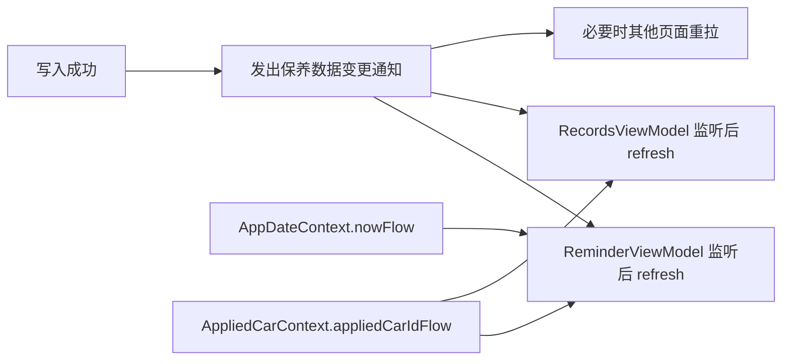

# Step 13 方案文档：统一保养数据变更通知与提醒页刷新收口

## 1. 目标与范围
- 目标：把“保养记录、车辆项目配置、日期/车型上下文变化”引发的页面刷新收口到统一机制，避免 `app` 层和各 `feature` 之间散落回调。
- 范围：
  - 保养提醒页的数据刷新。
  - 保养记录页的数据刷新。
  - 编辑车辆后，提醒页对项目间隔的重拉。
  - 新增/编辑/删除保养记录后，提醒页对最新记录索引的重拉。
  - 导入恢复后，相关页面的统一失效。
- 非范围：
  - 业务规则本身的改写。
  - 提醒算法、记录去重口径、日期换算口径的变化。

## 2. 当前现状
- 业务上下文已经有两个稳定入口：
  - `core/datastore/src/main/java/com/tx/carrecord/core/datastore/AppDateContext.kt`
  - `core/datastore/src/main/java/com/tx/carrecord/core/datastore/AppliedCarContext.kt`
- 当前已经存在的页面级监听：
  - [feature/my/src/main/java/com/tx/carrecord/feature/my/ui/MyUiPlaceholder.kt](/Users/tx/develepment/workspace/car-record-android/feature/my/src/main/java/com/tx/carrecord/feature/my/ui/MyUiPlaceholder.kt)
    - 监听 `isManualNowEnabledFlow`
    - 监听 `manualNowDateFlow`
    - 监听 `nowFlow()`
  - [feature/reminder/src/main/java/com/tx/carrecord/feature/reminder/ui/ReminderUiPlaceholder.kt](/Users/tx/develepment/workspace/car-record-android/feature/reminder/src/main/java/com/tx/carrecord/feature/reminder/ui/ReminderUiPlaceholder.kt)
    - 监听 `appliedCarIdFlow`
    - 监听 `nowFlow()`
  - [feature/records/src/main/java/com/tx/carrecord/feature/records/ui/RecordsUiPlaceholder.kt](/Users/tx/develepment/workspace/car-record-android/feature/records/src/main/java/com/tx/carrecord/feature/records/ui/RecordsUiPlaceholder.kt)
    - 监听 `appliedCarIdFlow`
    - 当前主要依赖手动 `refresh()` 和页面内显式写操作后刷新
- 当前问题的根因：
  - `AppDateContext` 和 `AppliedCarContext` 只能覆盖“时间/当前车辆变化”。
  - 车辆编辑页保存项目间隔、记录页保存/删除记录后，提醒页没有统一的“数据已变更”失效信号。
  - 为了补洞，`app` 层临时挂了多个 `refresh()` 回调，后续会越来越散。

## 3. 设计原则
- 页面只监听自己真正依赖的状态源，不互相监听对方的 ViewModel。
- 写操作只负责落库并发出“数据已变更”信号，不直接驱动别的 feature 的 UI。
- `app` 层只做页面编排，不承载跨 feature 的业务刷新逻辑。
- 统一信号只用于“数据变了，相关页面该重新读库”，不承载业务内容。

## 4. 方案总览
- 新增一个统一的“保养数据变更通知”入口。
- 所有会影响提醒页、记录页展示结果的写路径，在事务成功后发出一次变更通知。
- 提醒页、记录页订阅这个通知后自行 `refresh()`。
- 记录页与提醒页之间不再通过 `app` 层传递具体刷新回调。

### 4.1 推荐形态
- 建议把通知抽象成一个轻量上下文，例如：
  - `MaintenanceDataInvalidationContext`
  - 或 `MaintenanceDataChangeContext`
- 职责只保留两件事：
  - `notifyChanged(...)`
  - `changesFlow`
- 表达形式可以是以下两种之一：
  - `SharedFlow<Unit>` / `MutableSharedFlow<Unit>`
  - 版本号流 `StateFlow<Long>`，每次写入成功自增

### 4.2 为什么不继续堆 callback
- callback 只能解决“当前这一个保存点”。
- 一旦新增删除入口、导入恢复入口、别的保存入口，就要继续往 `app` 层补回调。
- 结果是：
  - 页面编排层知道太多数据层细节。
  - feature 之间虽然没有直接 import，但实际上被 `app` 串成了隐式耦合。

## 5. 涉及改造点

### 5.1 `core/datastore`
- 位置：
  - `core/datastore/src/main/java/com/tx/carrecord/core/datastore/`
- 建议新增：
  - `MaintenanceDataChangeContext.kt`
  - 默认实现可放在 `Datastore...` 同目录下
- 作用：
  - 作为“保养数据已变更”的统一发信点。
  - 提供一个只读流给页面订阅。
- 注意：
  - 这里不存业务内容，不记录具体记录 ID、项目名等敏感细节。
  - 只负责“发生过变化”这个事实。

### 5.2 `feature/reminder`
- 位置：
  - `feature/reminder/src/main/java/com/tx/carrecord/feature/reminder/ui/ReminderUiPlaceholder.kt`
  - `feature/reminder/src/main/java/com/tx/carrecord/feature/reminder/data/ReminderRepository.kt`
- 现状：
  - `ReminderViewModel` 已监听 `appliedCarIdFlow` 和 `nowFlow()`。
- 改造后：
  - 再监听“保养数据变更通知”。
  - 变更到达后调用 `refresh()`，重新读取：
    - 当前车辆
    - 当前车辆的记录
    - 当前车辆的项目配置
    - 最新提醒行
- 原因：
  - 提醒页的“时间进度”和“项目间隔”都来自记录与项目配置的组合结果。

### 5.3 `feature/records`
- 位置：
  - `feature/records/src/main/java/com/tx/carrecord/feature/records/ui/RecordsUiPlaceholder.kt`
  - `feature/records/src/main/java/com/tx/carrecord/feature/records/data/RecordRepository.kt`
- 需要覆盖的写路径：
  - 新增记录
  - 编辑记录
  - 删除整条记录
  - 按项目删除记录项
  - 保存“下次间隔确认”回写项目默认值
- 改造方式：
  - 在写入成功后发统一变更通知。
  - 记录页自己 `refresh()`。
  - 提醒页也通过同一通知刷新。
- 说明：
  - 不建议让 `RecordsViewModel` 继续依赖 `app` 层传入的外部 `onRecordsChanged` 回调。

### 5.4 `feature/addcar`
- 位置：
  - `feature/addcar/src/main/java/com/tx/carrecord/feature/addcar/ui/AddCarManagementUi.kt`
  - `feature/addcar/src/main/java/com/tx/carrecord/feature/addcar/data/CarRepository.kt`
- 需要覆盖的写路径：
  - 新增车辆
  - 编辑车辆
  - 保存车辆对应的项目间隔配置
  - 删除车辆
  - 车辆应用状态变化通常不走“数据变更通知”，而是继续走 `AppliedCarContext`
- 改造方式：
  - 保存车辆和项目配置成功后发统一变更通知。
  - 提醒页收到通知后重新读取当前车辆项目配置。
- 原因：
  - 你遇到的“编辑车辆后提醒页还是旧间隔”本质上就是这里缺少失效通知。

### 5.5 `feature/datatransfer`
- 位置：
  - `feature/datatransfer/src/main/java/com/tx/carrecord/feature/datatransfer/data/BackupRepository.kt`
  - `feature/datatransfer/src/main/java/com/tx/carrecord/feature/datatransfer/ui/DataTransferUi.kt`
- 需要覆盖的写路径：
  - 导入恢复
  - 覆盖当前车辆、记录、项目配置
- 改造方式：
  - 导入恢复完成后发统一变更通知。
  - 相关页面统一重拉。
- 原因：
  - 导入会同时影响车辆、项目、记录三个层面的展示结果，属于典型的全量失效场景。

### 5.6 `app`
- 位置：
  - `app/src/main/java/com/tx/carrecord/app/ui/CarRecordRoot.kt`
- 当前临时状态：
  - `app` 层还承担了部分“保存成功后刷新提醒页”的编排。
- 最终目标：
  - 去掉 `app` 层对具体页面刷新回调的手工串联。
  - 只保留页面挂载与导航编排。
- 最终职责：
  - 提供 ViewModel 实例。
  - 组织页面。
  - 不知道“哪个 feature 写完后该去刷新另一个 feature”。

## 6. 监听与通知边界

### 6.1 应保留的监听
- `AppDateContext.nowFlow()`
  - 影响提醒进度、今日到期判断、编辑页默认日期展示。
- `AppDateContext.isManualNowEnabledFlow`
  - 影响个人中心开关展示。
- `AppDateContext.manualNowDateFlow`
  - 影响个人中心手动日期展示。
- `AppliedCarContext.appliedCarIdFlow`
  - 影响当前车辆切换后的页面内容。

### 6.2 建议新增的统一通知
- `MaintenanceDataChangeContext.changesFlow`
  - 影响：
    - 保养提醒页
    - 保养记录页
    - 编辑车辆后相关提醒展示
    - 导入恢复后的全局数据重拉

### 6.3 不建议新增的监听
- 不要让提醒页直接监听记录页 ViewModel。
- 不要让记录页直接监听提醒页 ViewModel。
- 不要让 `app` 层充当“事件总线式的手工转发器”。

## 7. 预期调用链

## 8. 风险与约束
- 风险：
  - 通知粒度太粗会导致页面刷新过多。
  - 通知粒度太细会漏场景，继续出现“必须重启 app 才更新”。
  - 如果把通知写成业务事件，后面会被误用成消息总线。
- 约束：
  - 通知只表达“需要重拉数据”。
  - 通知不携带具体业务数据。
  - 页面收到通知后自己决定是否真正刷新。

## 9. 迁移顺序建议
1. 先落 `core/datastore` 的统一通知抽象。
2. 让 `ReminderViewModel` 和 `RecordsViewModel` 先订阅统一通知。
3. 把 `feature/records` 写路径改成发通知。
4. 把 `feature/addcar` 写路径改成发通知。
5. 把 `feature/datatransfer` 恢复完成后的路径改成发通知。
6. 移除 `app` 层中临时的手工刷新回调。

## 10. 验收标准
- 编辑车辆保存项目间隔后，进入保养提醒页立即显示新间隔。
- 在保养记录页新增、编辑、删除记录或按项目删除后，保养提醒页立即显示最新进度。
- 自定义日期变更后，提醒页按时间进度立即更新。
- 当前车辆切换后，提醒页和记录页都按新车辆重拉。
- `app` 层不再承接 feature 间的手工刷新回调。

## 11. 当前结论
- 现在的 callback 方案能工作，但维护成本高。
- 更稳妥的方向是：
  - 保留上下文监听
  - 新增统一数据变更通知
  - 页面自己订阅、自己刷新
- 这个方案能保持模块单向依赖，不会把 `feature` 之间耦合起来。
